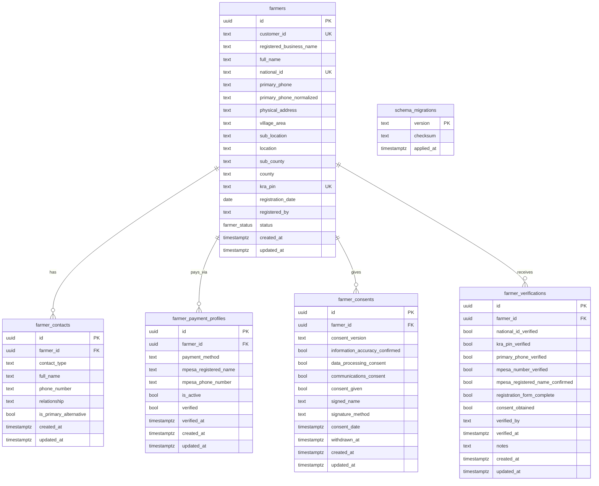

# Farmer registration ERD

```mermaid
erDiagram
    farmers ||--o{ farmer_contacts : has
    farmers ||--o{ farmer_payment_profiles : pays_via
    farmers ||--o{ farmer_consents : gives
    farmers ||--o{ farmer_verifications : receives
    farmers {
        uuid id PK
        text customer_id UK
        text registered_business_name
        text full_name
        text national_id UK
        text primary_phone
        text primary_phone_normalized
        text physical_address
        text village_area
        text sub_location
        text location
        text sub_county
        text county
        text kra_pin UK
        date registration_date
        text registered_by
        farmer_status status
        timestamptz created_at
        timestamptz updated_at
    }
    farmer_contacts {
        uuid id PK
        uuid farmer_id FK
        text contact_type
        text full_name
        text phone_number
        text relationship
        bool is_primary_alternative
        timestamptz created_at
        timestamptz updated_at
    }
    farmer_payment_profiles {
        uuid id PK
        uuid farmer_id FK
        text payment_method
        text mpesa_registered_name
        text mpesa_phone_number
        bool is_active
        bool verified
        timestamptz verified_at
        timestamptz created_at
        timestamptz updated_at
    }
    farmer_consents {
        uuid id PK
        uuid farmer_id FK
        text consent_version
        bool information_accuracy_confirmed
        bool data_processing_consent
        bool communications_consent
        bool consent_given
        text signed_name
        text signature_method
        timestamptz consent_date
        timestamptz withdrawn_at
        timestamptz created_at
        timestamptz updated_at
    }
    farmer_verifications {
        uuid id PK
        uuid farmer_id FK
        bool national_id_verified
        bool kra_pin_verified
        bool primary_phone_verified
        bool mpesa_number_verified
        bool mpesa_registered_name_confirmed
        bool registration_form_complete
        bool consent_obtained
        text verified_by
        timestamptz verified_at
        text notes
        timestamptz created_at
        timestamptz updated_at
    }
    schema_migrations {
        text version PK
        text checksum
        timestamptz applied_at
    }
```

Children use farmer UUIDs. The migration ledger is an independent infrastructure table.
